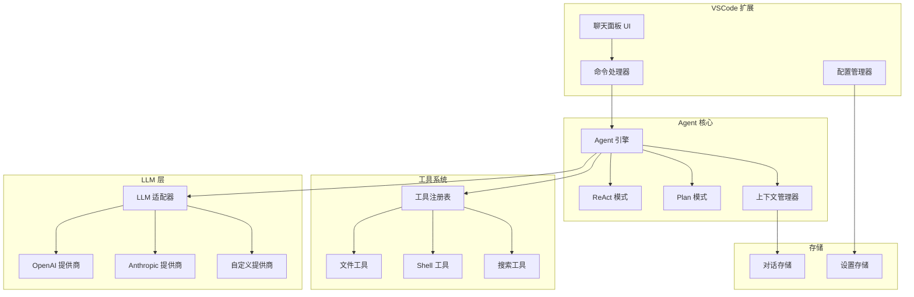

# 设计文档

## 概述

本设计文档描述了一个类似 Claude Code 的 VSCode Agent 扩展的技术架构。该扩展采用模块化设计，核心包含 Agent 引擎（支持 ReAct 和 Plan 模式）、工具系统、LLM 适配层、上下文管理器以及 VSCode 集成层。

### 核心设计原则

1. **模块化**: 各组件职责单一，通过接口解耦
2. **可扩展**: 工具和 LLM 提供商可插拔
3. **可观测**: Agent 行为对用户透明可见
4. **健壮性**: 完善的错误处理和恢复机制

## 架构



## 组件和接口

### 1. Agent 引擎（核心引擎）

Agent 引擎是系统的核心，负责协调各模块完成用户任务。

```typescript
interface AgentEngine {
  // 处理用户消息
  processMessage(message: string, mode: AgentMode): AsyncIterable<AgentEvent>;
  
  // 取消当前执行
  cancel(): void;
  
  // 获取当前状态
  getState(): AgentState;
}

type AgentMode = 'react' | 'plan';

type AgentState = 
  | { status: 'idle' }
  | { status: 'thinking'; thought: string }
  | { status: 'acting'; tool: string; params: unknown }
  | { status: 'planning'; plan: Plan }
  | { status: 'executing'; step: number; total: number };

type AgentEvent =
  | { type: 'thought'; content: string }
  | { type: 'action'; tool: string; params: unknown }
  | { type: 'observation'; result: ToolResult }
  | { type: 'plan'; plan: Plan }
  | { type: 'step_complete'; step: number; result: string }
  | { type: 'answer'; content: string }
  | { type: 'error'; message: string }
  | { type: 'token'; content: string };
```

### 2. ReAct 模式（推理-行动模式）

实现思考-行动-观察循环。

```typescript
interface ReActExecutor {
  execute(
    goal: 
    context: Context,
    tools: Tool[],
    llm: LLMAdapter
  ): AsyncIterable<>;
}

tep {
  thought: string;
  action: Action | null;
  observation?: string;
}

{
  tool: string;
  parameters: R;
}

;
```

模式）

。

pescript
interface Plaxecutor {
  createPlan(goal: strinan>;
  executentEvent>;
}

interface
  id: string;
  goal: string;
  steps: PlanStep[];
  status: PlanStatus;
}

i {

  description: s
  expectedOuting;
  status: StepStus;
  result?: string;
}

';
type StepStatus = 'p';
```


### 4. 工具系统

可扩展的工具注册和执行机制。

```typescript
interface Tool {
  name: string;
  description: string;
  parameters: ToolParameter[];
  execute(params: Record<string, unknown>): Promise<ToolResult>;
}

interface ToolParameter {
  name: string;
  type: 'string' | 'number' | 'boolean' | 'array' | 'object';
  description: string;
  required: boolean;
}

interface ToolResult {
  success: boolean;
  output: string;
  error?: string;
}

interface ToolRegistry {
  register(tool: Tool): void;
  get(name: string): Tool | undefined;
  list(): Tool[];
  getToolDescriptions(): string;
}
```

### 5. LLM 适配层

统一的 LLM 调用接口，支持多种提供商。

```typescript
interface LLMAdapter {
  streamComplete(messages: LLMMessage[], options?: LLMOptions): AsyncIterable<string>;
  complete(messages: LLMMessage[], options?: LLMOptions): Promise<string>;
  estimateTokens(text: string): number;
}

interface LLMMessage {
  role: 'system' | 'user' | 'assistant';
  content: string;
}

interface LLMOptions {
  temperature?: number;
  maxTokens?: number;
  stopSequences?: string[];
}

interface LLMProvider {
  name: string;
  createAdapter(config: LLMConfig): LLMAdapter;
  validateConfig(config: LLMConfig): Promise<boolean>;
}

interface LLMConfig {
  provider: string;
  apiKey: string;
  model: string;
  baseUrl?: string;
}
```

### 6. 上下文管理器

管理对话历史和上下文窗口。

```typescript
interface ContextManager {
  addMessage(message: Message): void;
  getContext(maxTokens: number): LLMMessage[];
  clear(): void;
  getHistory(): Message[];
}

interface Message {
  id: string;
  role: 'user' | 'assistant' | 'system' | 'tool';
  content: string;
  timestamp: number;
  toolCall?: {
    name: string;
    parameters: Record<string, unknown>;
    result: ToolResult;
  };
}
```

### 7. 对话序列化器

负责对话的持久化和恢复。

```typescript
interface ConversationSerializer {
  serialize(conversation: Conversation): string;
  deserialize(json: string): Conversation;
  exportReadable(conversation: Conversation): string;
}

interface Conversation {
  id: string;
  title: string;
  messages: Message[];
  metadata: ConversationMetadata;
  createdAt: number;
  updatedAt: number;
}

interface ConversationMetadata {
  model: string;
  totalTokens: number;
  toolsUsed: string[];
}
```

### 8. VSCode 集成层

```typescript
interface ChatPanelProvider {
  resolveWebviewView(webviewView: vscode.WebviewView): void;
  postMessage(message: UIMessage): void;
  onMessage(handler: (message: UIMessage) => void): void;
}

type UIMessage =
  | { type: 'user_message'; content: string }
  | { type: 'agent_event'; event: AgentEvent }
  | { type: 'clear_chat' }
  | { type: 'cancel' }
  | { type: 'set_mode'; mode: AgentMode };
```

## 数据模型

### 消息模式

```typescript
interface MessageSchema {
  id: string;
  role: MessageRole;
  content: string;
  timestamp: number;
  toolCall?: ToolCallSchema;
}

type MessageRole = 'user' | 'assistant' | 'system' | 'tool';

interface ToolCallSchema {
  name: string;
  parameters: Record<string, unknown>;
  result: { success: boolean; output: string; error?: string; };
}
```

### 对话模式

```typescript
interface ConversationSchema {
  version: number;
  id: string;
  title: string;
  messages: MessageSchema[];
  metadata: { model: string; totalTokens: number; toolsUsed: string[]; };
  createdAt: number;
  updatedAt: number;
}
```

### 计划模式

```typescript
interface PlanSchema {
  id: string;
  goal: string;
  steps: {
    id: number;
    description: string;
    expectedOutcome: string;
    status: 'pending' | 'running' | 'completed' | 'failed' | 'skipped';
    result?: string;
  }[];
  status: 'draft' | 'approved' | 'executing' | 'completed' | 'failed';
  createdAt: number;
  updatedAt: number;
}
```

## 正确性属性

*属性是指在系统所有有效执行中都应保持为真的特征或行为——本质上是关于系统应该做什么的形式化陈述。属性是人类可读规范和机器可验证正确性保证之间的桥梁。*

### 属性 1: 对话序列化往返一致性

*对于任意*有效的 Conversation 对象，将其序列化为 JSON 然后反序列化回来，应该产生一个等价的 Conversation 对象，所有消息、工具调用、时间戳、角色和元数据都被保留。

**验证: 需求 11.1, 11.2, 11.3**

### 属性 2: ReAct 循环结构不变性

*对于任意* ReAct 模式执行，执行序列中的每一步都必须遵循思考-行动-观察模式，其中思考事件总是在行动事件之前，观察事件在行动事件之后（当采取行动时）。

**验证: 需求 2.1, 2.2**

### 属性 3: 行动工具有效性

*对于任意* Agent 在 ReAct 执行期间选择的行动，行动的工具名称必须存在于已注册的工具集中。

**验证: 需求 2.3**

### 属性 4: ReAct 以答案终止

*对于任意*成功完成的 ReAct 执行（未取消或出错），最终事件必须是包含响应内容的 'answer' 类型事件。

**验证: 需求 2.5**

### 属性 5: 计划结构完整性

*对于任意* Plan 模式生成的计划，每个步骤都必须有非空的 description 和非空的 expectedOutcome 字段。

**验证: 需求 3.2**

### 属性 6: 计划顺序执行

*对于任意*已批准的计划执行，步骤必须按顺序执行（步骤 N 完成后才开始步骤 N+1），并且每个步骤后必须发出 step_complete 事件。

**验证: 需求 3.3**

### 属性 7: 计划修改保留已完成工作

*对于任意*计划修改请求，所有状态为 'completed' 的步骤在修改后的计划中必须保持不变。

**验证: 需求 3.5**

### 属性 8: 搜索结果包含模式

*对于任意*在工作区中有匹配的 grep 搜索查询模式 P，所有返回的结果内容中必须包含模式 P。

**验证: 需求 4.3**

### 属性 9: 文件搜索返回匹配路径

*对于任意*带有文件名模式的文件搜索查询，所有返回的文件路径必须匹配指定的模式。

**验证: 需求 4.4**

### 属性 10: 命令输出捕获

*对于任意*产生输出的 shell 命令执行，ToolResult 必须包含 stdout 和 stderr 内容（即使是空字符串）。

**验证: 需求 5.2**

### 属性 11: 工作区边界强制

*对于任意* shell 命令或文件操作，如果目标路径在工作区根目录之外，操作必须被拒绝。

**验证: 需求 5.5**

### 属性 12: 上下文完整性

*对于任意*发送给 LLM 的消息，上下文必须包含对话中所有之前的消息和之前工具调用的所有工具结果（受 token 限制约束）。

**验证: 需求 7.1, 7.5**

### 属性 13: 上下文 Token 限制合规

*对于任意*发送给 LLM 的上下文，总 token 数不得超过模型的最大上下文窗口，当需要截断时，必须保留最近的消息。

**验证: 需求 7.2**

### 属性 14: 上下文清除完整性

*对于任意*新对话请求，清除后上下文必须包含零条来自之前对话的消息。

**验证: 需求 7.4**

### 属性 15: 流式 Token 传递

*对于任意*流式 LLM 响应，token 必须在到达时增量产出，所有产出 token 的拼接必须等于完整响应。

**验证: 需求 10.1**

### 属性 16: 流式取消保留部分内容

*对于任意*被取消的流式操作，取消前收到的部分内容必须被保留且可访问。

**验证: 需求 10.3**

## 错误处理

### Agent 引擎错误

| 错误类型 | 条件 | 处理方式 |
|---------|------|---------|
| `LLMConnectionError` | LLM API 不可达 | 重试 3 次，然后通知用户检查网络和配置 |
| `LLMRateLimitError` | API 速率限制 | 指数退避重试，最多 5 次 |
| `ToolExecutionError` | 工具执行失败 | 将错误作为观察结果返回给 Agent 继续推理 |
| `MaxIterationsError` | ReAct 超过最大迭代 | 停止执行，返回当前进度 |
| `CancellationError` | 用户取消操作 | 立即停止，保留部分结果 |

### 工具错误

| 错误类型 | 条件 | 处理方式 |
|---------|------|---------|
| `FileNotFoundError` | 文件不存在 | 返回错误信息，建议搜索文件 |
| `PermissionDeniedError` | 无权限访问 | 返回错误信息，说明权限问题 |
| `CommandTimeoutError` | 命令执行超时 | 终止命令，返回已有输出 |
| `WorkspaceBoundaryError` | 访问工作区外路径 | 拒绝操作，返回安全错误 |

### 序列化错误

| 错误类型 | 条件 | 处理方式 |
|---------|------|---------|
| `InvalidJSONError` | JSON 格式错误 | 返回解析错误详情 |
| `SchemaVersionError` | 版本不兼容 | 尝试迁移，失败则报错 |
| `DataCorruptionError` | 数据完整性问题 | 返回错误，建议从备份恢复 |

## 测试策略

### 属性测试框架

本项目使用 **fast-check** 作为 TypeScript 的属性测试库。

```bash
npm install --save-dev fast-check
```

### 属性测试

每个正确性属性都将通过 fast-check 实现为属性测试：

1. **对话往返一致性 (属性 1)**: 生成任意 Conversation 对象，验证 `deserialize(serialize(conv))` 等于原始对象
2. **ReAct 循环结构 (属性 2)**: 生成 ReAct 执行序列，验证事件顺序符合思考-行动-观察模式
3. **行动工具有效性 (属性 3)**: 生成工具集和动作，验证所有动作的工具名在工具集中
4. **计划结构 (属性 5)**: 生成计划，验证所有步骤都有 description 和 expectedOutcome
5. **搜索结果 (属性 8)**: 生成搜索模式和文件内容，验证结果包含模式
6. **上下文完整性 (属性 12)**: 生成消息序列，验证上下文包含所有消息
7. **流式 Token (属性 15)**: 生成 token 序列，验证拼接结果等于完整响应

### 单元测试

单元测试覆盖以下关键场景：

1. **工具注册表**: 工具注册、获取、列表
2. **上下文管理器**: 消息添加、token 计算、截断
3. **计划执行器**: 计划创建、步骤执行、状态转换
4. **LLM 适配器**: 配置验证、错误处理

### 集成测试

集成测试验证组件协作：

1. **ReAct 完整流程**: 从用户输入到最终答案
2. **Plan 完整流程**: 从计划生成到执行完成
3. **VSCode 集成**: 扩展激活、面板创建、消息传递

### 测试配置

```typescript
const fcConfig = {
  numRuns: 100,
  verbose: true,
  seed: Date.now(),
};
```

### 测试注释格式

所有属性测试必须使用以下注释格式：

```typescript
/**
 * **Feature: vscode-agent, 属性 1: 对话序列化往返一致性**
 * **验证: 需求 11.1, 11.2, 11.3**
 */
test('对话序列化往返一致性', () => {
  fc.assert(
    fc.property(conversationArbitrary, (conversation) => {
      const serialized = serializer.serialize(conversation);
      const deserialized = serializer.deserialize(serialized);
      return deepEqual(conversation, deserialized);
    }),
    fcConfig
  );
});
```
